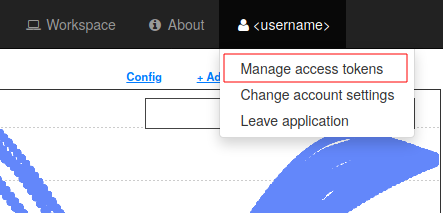
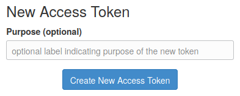
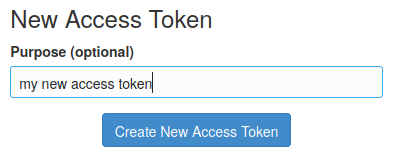
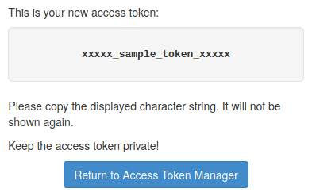
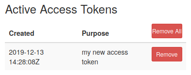

Access Token Management
=======================

An access token is required to access the VirES server.
The tokens are managed via the web user interface.

Assuming you have an existing VirES account and you can access
the VirES web client (https://vires.services or https://aeolus.services),
you get to token manager via *Manage access tokens* item in your account menu
(displaying your username)

The token manager user interface allows creation of new tokens by pressing the
*Create New Access Token* button

To distinguish different tokens, it is recommended to tag a new token by a
brief label indicating its purpose

Once the *Create New Access Token* button has been pressed, a new token is
generated and displayed to the user

As this point, you should copy the token to its destination.

The token manager list the active access tokens and allows their revocation

.. note::
  *The tokens are secret.* Therefore, do not keep thier copies or share them
  with others.  When a token is needed generate new one. When a token is no
  longer needed revoke it.
